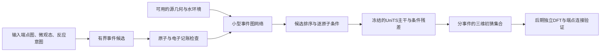

> 2026-09-22从mechai同步。源码规范以仓库为准：`/home/shen/文档/ChatGPT/mechai/docs/ARCHITECTURE_V0.md`。本页为可读镜像。

# 第一版架构决定：显式事件条件的三维候选模型

设计日期：2026-09-21；实现状态核对：2026-09-22。表示和模块接口保留冻结，配置见[冻结规格](<../../../ChatGPT/mechai/configs/experiments/event_architecture_v0.json>)。本次只同步实现状态，未修改实验配置、模型或旧结果。

**当前决定：关闭源TS排序调参，暂停扩大网络和事件条件几何联合训练。** 四水规则在41条/19组上已达@1 99.12%；11条/7组源端点敏感性支持TS几何捷径。完整结果见[当前进展](<2026-09-22 mechai当前进展.md>)。FlowER完成格式与numeric抽样，尚缺状态网络、全量独立留出和BE/自由基合同；后续工作按[研发路线](<2026-09-22 课题研发路线与验收.md>)推进。本文设计图不代表全部链条已经实跑。

## 要回答的科学问题

在给定基元反应意图、微观态与有限水环境时，**把质子去向和参与水显式表示出来，能否在相同候选预算下减少遗漏，并保留会改变机理解释的竞争路径？** 最终用Ala-SEt＋腺苷、2′-O-Me、2′-deoxy的结构扰动检验解释力。水接力只是待比较解释之一，另有酸碱物种、电子效应、构象和竞争水解。

AI承担“环境相关的候选排序及条件几何提案”。守恒规则负责限制表示，DFT在后期负责验证化学。模块组合本身不算创新；只有相同预算下对通道遗漏、跨环境迁移及结构扰动解释的证据，才能支持研究贡献。单纯RMSD变好不足以回答该问题。

## 冻结的结构

当前代码支持显式提供事件和有界可变长度规则枚举；图/环境排序器已在CH2O小型档案任务训练。事件条件UniTS训练/生成尚未接通，模块完成状态见文末。

### 输入与离散事件

每个样本保留固定原子清单、显式氢、总电荷、单重态、源几何（Å）、水成员标记、来源与理论层次。原子编号只作映射，不作学习特征。模型不自动推断缺失电荷、水数、pH或酸碱平衡。

端点Lewis状态用对称整数BE矩阵表示：非对角为键级，对角为非键电子数。候选`z`含重原子键变化、非键电子变化及显式`(供体,H,受体)`列表。多个转移可以表示水接力的净变化；列表顺序不表示真实时间，也不能单凭列表认定协同/分步。相同净变化的不同路径仍由几何候选和后续路径证据区分。

一次完整更新满足：

\[
B'=B+\Delta B_z,\quad B'=B'^T,\quad
\sum_{ij}B'_{ij}=\sum_i v_i-Q=\sum_{ij}B_{ij}.
\]

代码还拒绝负电子数、非整数BE、重复转移同一H及违反H壳层容量的端点。**这些是记账约束，不是完整化学合法性检查。** 当前支持CHNOS配对电子单重态，未提供全面价态白名单、自由基/金属支持或立体化学认证；含S的记账可表示不等于硫酯迁移已验证。不把TS的分数键级取整伪装成Lewis端点。

第一版接口的反应意图也是完整、守恒的假设变化；部分键模式意图尚未实现。原V0为最多2个参与水、32条候选；后续已完成2/4水、相同32候选预算的探索性比较，另有100,000次搜索上界。全部环境原子及记账可行的无接力备选保留，原配置不覆写。上限是计算边界，需要报告截断；不能据此宣称更长水链不存在。提案不足以涵盖真事件时，排序网络无法弥补覆盖缺口。

### 小型图网络：88,721参数

已实现`EventScorer(hidden_dim=64, layers=3, radial_features=16)`：

| 位置 | 实际信息与操作 |
|---|---|
| 节点 | 16维元素嵌入＋源非键电子/形式电荷、候选和意图的对角变化、水标记、总电荷，映射到64维 |
| 原子对 | 源距离的16维RBF＋源键级、候选键变化、意图键变化；RBF尺度8 Å，不是截断半径 |
| 消息层 | 3层全原子对标量消息、按有效邻居数归一、残差及LayerNorm；没有坐标更新 |
| 池化 | 候选变化原子与全部原子分别均值池化，再附原子数量特征 |
| 输出 | 一个参考事件对应分数，以及每原子64维不变量，用于几何条件接口 |

整体平移/旋转及同步原子置换不改变分数；交换水的编号不改变结果，但实际移动水可以改变结果。距离编码也对镜像不变，不能把它写成手性保证；后续目标核苷任务须保留立体标签并验证生成结构。

这个规模是预先选择的可检验起点，不是调参选出的最优模型。41条/19组的图/环境三种子对照已完成，环境模型未超过加强规则；不能据此扩大模型。详细结果见[事件报告](<../../../ChatGPT/mechai/docs/EVENT_CORRESPONDENCE_RESULTS.md>)。

### 几何部分

保留已复现的官方UniTS-Gen，首个事件条件实验冻结主干。事件编码输出作为现有`EquivariantEnvironmentResidual`的64维标量条件；残差初始为零，沿用原有扩散目标和采样器。这个桥接接口已用CPU测试，但**尚未接入真实UniTS事件训练/生成任务**。

环境编码读取可用源几何，残差读取生成过程中的当前坐标；两个坐标角色不可混用。条件引导不会硬性保证几何属于指定事件，更不保证它是鞍点。起步不再同时添加新flow主干、能量头、Δ势或端到端反应网络搜索器。

## 从论文保留哪些设计

| 来源 | 采用的思想 | 本版的具体取舍 |
|---|---|---|
| [FlowER, Nature 2025](https://doi.org/10.1038/s41586-025-09426-9) | 固定原子、显式H、电子/键记账 | 采用离散完整编辑与严格守恒检查；不复制整套连续BE流和取整修复，不当作波函数模型 |
| [MolGEN, Nat. Commun. 2026](https://doi.org/10.1038/s41467-026-75654-w) | 候选生成、TS提案与搜索/验证分工；同条件多样本 | 保留“事件→多几何→验证”的分解；暂不更换已经复现的生成主干，生成时间不作物理路径 |
| UniTS-Gen | 已有图条件三维生成与覆盖较广的元素范围 | 复用固定版本与评估入口；其旧条件有参考TS来源，不能当独立反应物输入 |
| [TS-DFM, Nat. Commun. 2026](https://doi.org/10.1038/s41467-026-74101-0) | 原子对/距离对几何任务有用 | 距离作为不变量编码；本版不另学距离矩阵、不另写坐标重建器 |
| [Kingfisher, JCTC 2025](https://doi.org/10.1021/acs.jctc.5c00245) | 自动微溶剂化搜索与低层次→DFT工作流 | 使用已有归档监督与来源记录；后期作为非AI搜索对照，起步不新增xTB/DFT |

依据是项目已保存的论文/SI/源码阅读报告，见`docs/references/`；本轮没有宣称完成新的全领域查新。React-OT初始化等替换项暂不进入V0，以保持对照可归因。

## 两个任务必须分开

**已完成先导、现已暂停扩展的档案任务**是“已有低层次源候选＋可用端点/意图/环境→与已有DFT参考事件的对应及条件几何”。这要求源端点与提取簇原子清单可映射。Kingfisher输入本身已经经历源搜索，源QM/MM与DFT/CPCM还混有环境处理差别；不能把全部误差称为纯电子结构方法修正。

**最终研究任务**是“反应物＋微观态/局部环境→候选事件与多几何→竞争路径”。它还需要反应物构象/水环境的提案方式、规则覆盖和后期独立DFT。当前候选修正结果不能直接证明已实现反应物到路径发现；最终氨酰化净反应也可能需要多个基元步骤。

源Lewis端点图、源坐标、候选事件必须有独立于目标的来源。DFT端点只用于标签，DFT TS/虚频派生的参与水或反应中心只能进入单独oracle组。代码提供oracle拦截，元数据标签仍须靠数据审计保证真实。

## 学什么、哪些标签不能使用

V0排序头的监督命题限定为：**该候选事件是否与这一条已有参考结果对应？** 在可靠原子映射下，匹配可标1，已有参考明确矛盾可标0；这个0仅表示“不对应此参考结果”，不表示该通道在物理上不存在。缺失、阈值歧义、映射不明、仅任务失败的记录不产生0标签。

代码实现带证据掩码、可按组加权的BCE。未知标签可以是NaN，梯度严格为0；整批未知返回零损失，不能制造学习信号。分数首先是档案采样协议下的对应分数，校准前不解释为概率；无论是否校准都不是通量、产率或反应可行性的物理概率。

几何损失只用于事件对应和原子映射有支持的配对。其余记录保留并报告覆盖率，不能在看过分数后删掉坏例再宣布几何改善。所有组沿用来源/近重复分组策略；新任务若增加重复联系应合并组，不因需要样本数拆组。

## 本轮数据证据：停止IRC与端点收敛分开

已对50条CH2O的100份源/DFT原始日志核对归档派生SHA，并按实际阶段提取终止消息，见[审计结果](<../../../ChatGPT/mechai/reports/kingfisher/ch2o-irc-v1/audit.json>)。

| 证据 | 源GFN2/SFAM | DFT |
|---|---:|---:|
| 两个IRC方向均明确报告收敛 | 3/50 | 0/50 |
| 单方向停止消息 | 88/100，均500步 | 100/100，均100步 |
| 后续两个端点优化均明确报告收敛 | 50/50 | 50/50 |

与历史SCINE通用工作流源码一致：先走有限IRC，再对两端优化，源码还描述了端点优化前扰动。精确归档prerelease仍不可得，因此源码只是旁证。**部分IRC＋端点优化是有用的档案连接证据，不自动等于失败，也不是完整收敛IRC。** 两端优化收敛不等于全部端点重新检查了频率，也不证明源/目标原子映射或质子通道一致。

此前8条粗C–O模式不同，在两个层次也都具有后续端点收敛记录；不能简单解释成“端点优化没有收敛”，亦不能据此确认真实通道切换。16相同、8不同、13歧义、13无唯一源端点的原分类保留，没有重拟合原距离pilot。

## 完成状态与下一项可执行工作

| 部件 | 2026-09-22实际状态 |
|---|---|
| 显式事件、守恒记账、质子转移编译 | 已实现；不是物理可行性认证 |
| 有界可变长度枚举 | 已实现；完成2/4水、32预算比较与搜索上界保护 |
| CH2O限制域标签导出 | 已完成41条/19组，9条未知保留；使用源模板/TS与档案端点标签 |
| 88,721参数排序器、组权重/证据掩码训练 | 已完成114次固定步数拟合；没有超过加强规则 |
| 64维条件桥接 | 已实现并CPU测试；尚无真实事件条件UniTS训练/生成 |
| CH2O/CO2日志、可用性和源输入敏感性 | 已完成；有限IRC/端点优化与完整路径认证分开 |
| 产品无关事件输入 | USPTO净核心基线完成；FlowER格式/抽样完成，全量身份、网络和BE合同未完成 |
| 目标核苷、模型方法增益、独立DFT | 尚无结果 |

下一项工作是核查实际状态输入、标签选择与独立留出，见[FlowER入口](<../../../ChatGPT/mechai/docs/FLOWER_DATA_GATE.md>)及[研发路线R0](<2026-09-22 课题研发路线与验收.md>)。当前不能只替换11条源端点坐标后继续训练同一个排序器，也不将FlowER图标签直接接入水相几何模型。

新输入成立后，先比较强规则/频率与一个最小学习组件；有可靠事件/几何配对后才研究有无显式事件的条件几何。总候选预算按输入计，oracle单列，未知通道不当物理负例。首轮与后续探索的原始记录见[事件报告](<../../../ChatGPT/mechai/docs/EVENT_CORRESPONDENCE_RESULTS.md>)和[四水/CO2报告](<../../../ChatGPT/mechai/docs/RELAY_COVERAGE_AND_CO2_RESULTS.md>)。
