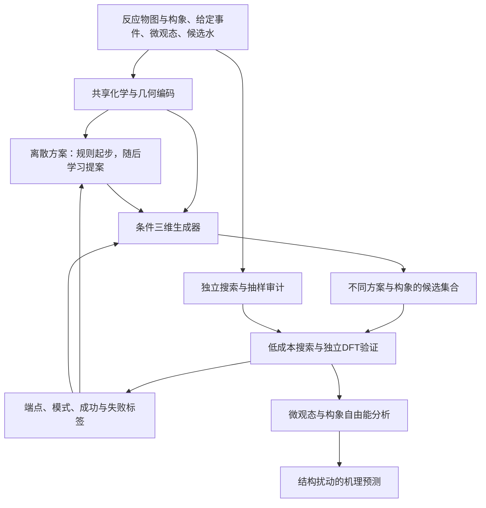

# 前生物氨酰化的AI架构设计：从论文组件到可检验的模型

## 先给选择

**建议采用“化学事件与质子转移方案 → 条件三维生成 → 独立物理验证”的分层架构，以随机、反应中心条件化的三维生成器作为第一版可训练核心。** 第一阶段由规则提供多种离散方案，随后再检验是否值得学习离散方案；低成本势与DFT接口独立保留。不要第一天就同时训练电子图生成器、三维生成器、反应势和自由能预测器。

这与简单拼接FlowER和MolGEN的区别，是明确建模**相同净反应下不同的质子传递实现**。它仍是设计假说，不是已证明的新颖方法。论文给我们的首先是归纳偏置、数据和验证方式，不是可直接拼接且必然奏效的权重。

关联科学问题：[[2026-09-21 新文献后的选题判断｜前生物氨酰化与AI机理发现]]。模型服务于O-Me/deoxy结构扰动下氨酰化差异的解释；它不直接以24小时终点产率为训练标签。

## 1. 先区分三个研究对象

| 研究对象 | 模型实际要学什么 | 对应论文 | 对本课题的作用 |
|---|---|---|---|
| 离散化学变化 | 原子之间的电子/键如何重新分配 | FlowER | 合法事件与机理候选 |
| 静态三维过渡态 | 哪些几何能成为指定事件的鞍点初猜 | React-OT、MolGEN、UniTS-Gen、TS-DFM | 当前推荐的生成核心 |
| 有限温度反应动力学 | 在给定势能和条件下，哪些构型/路径携带实际反应通量 | 反应MLP、qGNN | 解释真实选择性的后续物理层 |

三者之间不是简单等号。净键变化相同，可以有不同水接力和多个TS；单个TS可以对应不止一种动力学去向；几何生成模型的采样概率也不是反应通量。

因此，当前任务是生成值得独立验证的**机制候选集合**。若最终要量化溶液速率和选择性，仍须走到微观态、构象与自由能的统计处理。

## 2. 从各篇论文具体学习什么

| 论文 | 架构设计与训练对象 | 可借鉴的部分 | 不宜直接照搬的假设 |
|---|---|---|---|
| [FlowER](https://doi.org/10.1038/s41586-025-09426-9) | BE矩阵的RBF编码与时间编码进入图Transformer注意力；分别预测成键/非键电子变化，对连续向量场施加对称与零和约束 | 把守恒放进表示和解码，不完全依赖损失惩罚；显式H记账 | BE描述电子记账状态、ΔBE描述净变化，不是波函数；相同净变化不足以区分所有水接力；保总和取整也未保证最终对称和价态 |
| [React-OT](https://doi.org/10.1038/s42256-025-01010-0) | 对齐R/P的坐标中点出发，object-aware LEFTNet学习到TS的确定性流 | 好的初始分布比纯噪声更接近搜索问题；低层次数据迁移 | 固定端点给固定输出不适合直接表示多种水组织；没有产品几何时不能直接使用其条件 |
| [MolGEN](https://doi.org/10.1038/s41467-026-75654-w) | 产物和TS两个独立模型；球谐几何消息＋等变Transformer；随机初态支持多候选 | 随机潜变量、多条件几何消息，以及分开定义事件发现和TS生成 | 坐标ODE不是物理路径；全分子纯噪声重建会把容量花在已有核苷骨架上 |
| [UniTS-Gen](https://doi.org/10.1038/s41467-026-77230-8) | 分子图/位点子图编码，通过拓扑融合进入高阶等变网络，坐标扩散预测噪声 | 最贴近“已知反应中心、未知TS构型”的输入；电荷/自旋条件及位点引导 | 基准位点来自参考TS，不等于部署时已知完整质子链；不能把参考答案的参与原子当输入 |
| [TS-DFM](https://doi.org/10.1038/s41467-026-74101-0) | 双分支处理端点条件与中间距离，距离空间流匹配，再重建坐标 | 距离约束、几何一致性诊断、端点扰动找替代通道 | 任意距离矩阵未必能嵌入三维；距离自身无法区分镜像；仍需已知R/P且基础推理确定性 |
| [DeePEST-OS](https://doi.org/10.1038/s41467-026-72945-0) | MACE学习DFT与xTB能量/力之差，修正势接鞍点优化 | 将准确势能与候选生成分开；低高层次差值学习 | 能量/力标签不能直接监督TS生成；只用xTB成功路径会遗失xTB假阴性 |
| [qGNN](https://doi.org/10.1038/s43588-026-00958-2) | GVP处理标量/向量；共享权重处理时间间隔构型对，以变分损失学习committor | 若以后要识别动态上真正重要的环境，可学习反应进程而非只看虚频 | 需要相关轨迹、状态定义和动力学假设；不是给静态TS多接一个分类头就能学到 |

RitS有图条件、含S/带电的摘要证据，但本轮未取得其完整架构；不据摘要猜测网络层或训练目标。Kingfisher没有可直接借用的生成网络，却是非常重要的**任务设计和数据来源参考**：自动构造环境、搜索多个通道、验证连接，而不把反应性水等同于全部重要溶剂。

FlowER还需要一个实现层面的澄清：本轮核查的官方代码版本，forward读取元素、有效长度、当前噪声BE和伪时间，没有独立的反应物BE、反应中心、三维环境或pH条件通道。反应物通过初始状态影响生成；“conditional flow matching”这个名称不意味着已经具备我们需要的全部条件接口。代码版本与论文原始实现不能混为一谈，具体commit见[[FlowER约束与离散模块]]。

## 3. 三条架构路线的取舍

| 路线 | 主体模型 | 适合解决的瓶颈 | 当前判断 |
|---|---|---|---|
| A：先学反应势，再增强采样 | charge-aware等变势或xTB＋Δ势 | 已知反应空间内充分采样与自由能 | 有强文献基础；若科学瓶颈是统计而非漏通道，应转向这一条 |
| B：离散方案条件化的三维生成 | 图/几何编码＋方案提案＋随机等变flow | 哪种反应实现值得寻找，如何提供多样初猜 | **推荐用于当前先导**，可以分步验证，也便于分析失败来自哪层 |
| C：直接学整条反应轨迹/committor | 路径生成器或轨迹变分模型 | 动态过渡集合、反应坐标与通量 | 问题更接近最终物理目标，但需要轨迹与可靠势，当前不作首个模型 |

B不是因为“生成模型更新颖”而获选，而是它能直接检验当前假说：**遗漏的环境参与方案是否会改变结构选择性的解释？** 如果普通搜索已充分覆盖机制，只剩自由能不收敛，继续优化B就偏离问题，应选A。架构选择要允许被先导结果推翻。

## 4. 输入和输出：必须先定清楚

对每个微观态和固定组成单独提出任务，记条件为：

$$C=(G_R,X_R,Z,Q,S,e,\mathcal W,\mathcal P).$$

- $G_R$：反应物图，含显式H、键阶、形式电荷和固定立体化学。
- $X_R$：一个反应物复合物/水合环境构象；应采样多个起始构象，不能把单一水排布当作全部环境。
- $Z,Q,S$：元素、总电荷、自旋标签。首版可限定所选闭壳层微观态，模型接口仍显式保留这些信息。
- $e$：候选基元事件/反应中心，例如亲核加成或消除；不包含从真实TS读出的完整活性水列表。
- $\mathcal W$：本次可用水分子的完整集合。第一版只处理固定水数条件，跨水数分别采样与评估。
- $\mathcal P$：量化层次和环境协议。只有训练存在相应差异时才学习跨协议条件，不能用一个标签代替缺失数据。

输出不是一句“最可能机制”，而是候选集：

$$\{(z_k,\widehat X_k,\widehat s_k,\text{provenance}_k)\}_{k=1}^{K}.$$

$z_k$表示质子传递方案和事件对应的端点变化；$\widehat X_k$为TS初猜；$\widehat s_k$为固定验证协议下的成功倾向/不确定性，**不是势垒或通量**；来源字段用于追踪来自规则、模型还是独立搜索。

### 不把整个酰基取代强行塞进一个TS

硫酯与醇的净转化可能是协同过程，也可能先形成四面体中间体再消除。事件集合至少允许加成、消除、独立质子转移，以及化学上合理的协同组合。**输出单个TS的模型一次对应一个基元事件**；多个事件由外层图串联。

所谓质子转移方案的多个H转移动作可以在同一个基元事件内协同发生。序列解码的先后顺序只是表示方式，不应自动解释为真实反应先后。一条接力通常涉及多个不同H的交换，不等于同一个H逐个穿过所有水分子。

## 5. 推荐的模块设计

### 5.1 共享编码：化学图与空间邻域都要看

一个图编码分支读取键、电荷、H和反应中心标记；一个等变几何分支读取原子相对位置、距离与方向。通过标量条件调制/注意力连接，更新向量或高阶特征时保持整体旋转、平移对称性。

边至少区分共价邻接、当前空间邻接、候选反应关系。质子供受体可以跨非共价边通信，不能只沿反应物共价图传消息。短程局部消息之外保留全局电荷和远端分子上下文，避免仅凭截断半径假定邻位氧或核苷碱基无关。

反应物、水和供体在同一个实际三维环境中，其相对位置有化学意义。不能将每个分子独立旋转后仍声称保留了同一个水合环境；只对整个复合物施加刚体变换作为数据增强。独立端点表示的object-aware设计不能未经检查直接移植到共处一盒的溶剂。

首版不靠硬删除原子缩小问题：核苷骨架和全部候选水都保留，可以对稳定骨架施加柔性先验，但最终量化优化允许所有原子响应。具体层数与宽度待数据规模确定；它们不是这里首先需要创新的地方。

实现时可以把张量接口先固定下来，避免模块之间传递含糊的“机理向量”：

| 张量/条件 | 典型形状 | 含义 |
|---|---|---|
| 节点化学特征 | $N\times d_h$ | 元素、形式电荷、显式H、手性、反应中心角色 |
| 原子对条件 | $N\times N\times d_e$或稀疏边 | 成断键假设、质子供受体关系与当前空间距离 |
| 全局条件 | $d_c$ | 总电荷、自旋及明确的环境/方法协议 |
| 几何输入 | $X_t,X_R\in\mathbb R^{N\times3}$ | 生成中坐标与起始环境；处于同一坐标系 |
| 几何输出 | $v_\theta\in\mathbb R^{N\times3}$ | 每个原子的生成速度，不是量化力 |

标量条件注入高阶网络的$\ell=0$通道；反应边/接力边进入原子对消息，避免只池化成一个全局向量而丢失“谁向谁转移”的信息。先选一个主干实现，不将GCN、LEFTNet、HiEGNN和MACE全部堆叠为四个编码器。

### 5.2 离散方案：电子守恒之外，显式表示质子传递

用$z=(\Delta B,\Pi)$表示一个方案。$\Delta B$是事件的端点BE变化；$\Pi$是原子映射下的质子转移关系集合，例如供体重原子—H—受体重原子三元组，以及必要的协同关系。

**为什么仅用$\Delta B$不够？** 忽略可交换质子身份或对等价水规范化后，不同水接力可产生同样净反应；即使保留显式H映射，端点变化也没有唯一确定沿途顺序与几何。额外的$\Pi$是候选机制的表示，不是声称真实电子运动必须沿模型画出的箭头。

显式$z$也不是唯一可能的建模方式：直接生成全原子坐标的模型可以隐式表达不同接力。增加$z$的理由是可控采样、明确覆盖与错误诊断，代价是标签歧义和候选空间限制。必须用不带$z$、其他条件相同的生成器作对照，不能预先把层级结构当成更好的答案。

第一版对合理供受体做有界枚举，不固定“必须两水/必须邻OH”，并让多种方案进入同一个几何生成器。数据足够后，可用指针/集合解码器从全体系O/N/S及H中提出转移组合，采用守恒约束解码。O/N/S供受体集合是本课题的范围选择，不代表一般反应化学的完备列表；需保留范围外候选的独立搜索入口。没有可靠路径标签时，不能凭注意力最大值伪造$\Pi$真值。

FlowER启发的约束分两层：

1. 连续表示保持电子总数与矩阵对称性；固定原子集合保证元素和总H不凭空增加。
2. 离散端点联合检查对称、整数、非负电子数、允许价态及总电荷。不对整张矩阵独立取整后假设一切仍合法。使用上三角参数化时，总电子计数中非对角项计两次。

对端点可做化学合法性检查；**不能强制TS坐标符合普通稳定分子的整键阶和键长**，也不能要求生成伪时间的每一帧都是可分离的合法中间体。硫的价态规则同样不能统一套用全体原子的八隅体。

### 5.3 三维生成器：保留反应物骨架先验，同时保留随机性

推荐形式是**带结构先验的随机条件flow**：学习

$$p_\theta(X^{\mathrm{TS}}\mid z,C),$$

主干采用能同时处理标量与方向信息的等变网络，条件来自图、事件、质子方案、起始几何和电荷。借UniTS的位点条件、MolGEN的多样采样、React-OT的较好初始分布；不要求照搬其中某篇的完整网络或权重。

一个可实现的起点是：对齐坐标系后，以合理反应物复合物/粗初猜$X_a$为锚点，采样

$$X_0=X_a+\epsilon,\quad \epsilon\sim\mathcal N(0,\Sigma_C).$$

反应区、水及柔性位点使用较大的扰动，稳定骨架较小但非零；水的相对取向与分子构象另有独立多初始构型。若只在一个构型周围加极小噪声，仍可能没有跨通道覆盖。$\Sigma_C$按原子角色设置各向同性块，不用依赖实验室坐标轴的任意协方差。

对整个复合物统一去中心并保持一致原子映射；不能分别把每个水移回原点。几何配准只允许正常旋转，不用镜像消除立体误差。这里$X_R$是候选构造条件，训练所得分布也受初猜和优化流程影响，不应解释为平衡水合环境下的TS统计权重。

对经过核实的目标TS $X_1$，先采用简单条件流匹配：

$$X_t=(1-t)X_0+tX_1,\quad
\mathcal L_{\rm FM}=\mathbb E\|v_\theta(X_t,t\mid z,C)-(X_1-X_0)\|_W^2.$$

这条直线仅用于训练，不是物理反应路径。加权$W$可以使质子、反应中心与环境都得到监督，防止大量稳定骨架原子的损失淹没小部分关键自由度。其权重须消融，不能将非反应区域权重置零后假设环境不重要。

几何一致性项可辅助避免碰撞、保持未反应手性和局部合理性；施加对象应是预测终态/重建结构，而非强迫所有噪声插值满足真实几何。距离损失可借TS-DFM，但不强制使用距离矩阵作为唯一生成空间。

**手性单独处理。** 距离本身不能区分镜像；仅声称SE(3)等变也不保证生成保持D/L构型。对未改变的手性中心输入立体标签，检查有向体积及最终立体化学；对反应涉及的中心则使用正确事件约束，不能错误冻结本应改变的手性。

**水置换单独处理。** 等价水编号不应影响提案。训练匹配、评估和去重允许物理等价的水/H置换，但映射须在一条候选及其端点中一致，不能逐帧任意换H身份制造平滑的假路径。有同位素标记时不得交换不同同位素。

### 5.4 何时才称为“联合学习”

概率分解可写为：

$$p(z,X\mid C)=p_\phi(z\mid C)p_\theta(X\mid z,C).$$

它适合调试，但**画出这条公式不等于已经解决端到端联合优化**。可以先分阶段训练，再共享编码并交替更新；离散决策涉及采样/解码，普通反向传播不会自动穿过它，更不会自动穿过DFT鞍点求解器。

需要专门检验训练时使用真方案、部署时使用预测方案带来的分布差异。混入预测方案后，仅用重新验证的$z$—TS配对更新正几何监督，不能把错误方案与原本的正确TS硬配为正例。对该协议下未找到匹配TS的方案，失败记录用于独立成功头或保持未决，不据此认定物理上不可实现；同时保留低提案概率的探索分支。若要用连续松弛或策略梯度，应当在基本基线成立后再引入。

### 5.5 物理模块保持独立

可选的Δ势为：

$$E_{\rm corr}=E_{\rm xTB}+\Delta E_\psi,\qquad
F_{\rm corr}=F_{\rm xTB}-\nabla_X\Delta E_\psi.$$

同一几何、组分、电荷与环境定义下的DFT/xTB差值才是监督。这个模块学习能量和力，生成器学习结构分布，两者数据和损失不能混用。

不要直接用“能量越低越好”的guidance训练TS生成器：极小值可能比鞍点更低；仅使$\|\nabla E\|$小也不能区分极小值、错误鞍点与目标鞍点。首版使用后置的鞍点优化、振动模式及IRC验证，曲率约束留作有标签后的研究变量。

低成本搜索失败的一部分样本仍进入独立DFT审计。否则闭环只会反复强化它已经找得到的机制。搜索未成功应记录为优化失败或未知，不等于通道物理上不存在。分别保存提议的$z_{\rm proposed}$与路径核查后实际实现的$z_{\rm realized}$：优化转入另一条有效接力时，将它保存为替代通道，不能只因不匹配原方案就丢弃；几何正监督使用核实后的匹配方案。

## 6. 训练数据必须和模块对应

| 模块 | 监督记录 | 不可替代的东西 |
|---|---|---|
| 方案提案 | 经路径检查的质子转移方案、端点事件、允许的多个解 | 单个总反应SMILES没有全部接力标签 |
| 几何生成 | 同组成/微观态/方案下的多个已验证TS及其条件构象 | 路径中的随机帧不是TS标签 |
| Δ势 | 同几何的低高层次E/F，以及关键区域采样 | 一小批TS坐标不能提供完整局部曲率 |
| 成功预测 | 统一优化协议下的成功、错误端点、极小值、失败等 | “距参考小于0.2Å”不等于正确IRC |
| committor | 定义状态与动力学下的轨迹/射击或合适的变分训练对 | 静态能垒和生成频率不是动力学概率 |

方案标签可从IRC或验证过的路径中提取，但阈值与原子映射会造成歧义。保持多标签或不确定标记，不强迫每条路径唯一属于手写类别。直接运动的水可由路径检查标注；“稳定化水”的重要性通常需要两端一致的扰动/重算或统计检验，不能由注意力或虚频大小直接给出。

当前只有几个核苷对照，不能据此从零训练一个跨化学体系生成器。需要预训练/迁移与相关反应数据，具体可用权重的含S、电荷和任务条件仍要核实。**架构可定义、标签可生产和少样本可学，是三件不同的事。**

## 7. 让架构选择可以被实验推翻

最有信息量的比较不是一开始堆满模块，而是下列逐级实验；所有方案使用相同输入信息与验证协议。

| 对照 | 对架构提出的问题 |
|---|---|
| 规则/独立搜索＋标准几何初猜 | 不学习时已经能得到哪些机制？ |
| 同一离散方案＋直接几何修正 vs 随机条件flow | 随机性是否真正恢复不同通道，而不只是产生重复构象？ |
| 直接条件三维生成 vs 显式方案$z$条件化生成 | 显式离散层是否必要，是否因预定义类别反而漏掉新通道？ |
| 规则方案＋条件flow vs 学习方案＋同一flow | 学到的离散提案是否增加机制覆盖，还是只重排规则列表？ |
| 图条件 vs 图＋起始环境几何 | 显式环境信息是否帮助留出底物，而不是记忆水的位置？ |
| 完整原子体系与物理验证不变，遮蔽/保留旁观水的环境编码 | 模型是否需要显式利用非接力水的信息？ |
| 另做微溶剂化敏感性：减少/补入周围水，并匹配参照处理 | 物理模型本身的截断是否改变结论？这不是纯架构消融 |
| xTB筛选 vs 加入独立DFT审计 | 低层次是否系统性排除了重要通道？ |
| 固定规则＋经典几何搜索 vs 完整学习方案 | 学习是否改变科学解释或预测能力？ |

可以额外使用真实质子方案作**oracle诊断**，估计几何模块的上限；它必须单独报告，不能作为部署结果。不要把Kingfisher输出或DFT虚频标出的活性水偷偷放入模型的正常输入。

主指标是正确DFT连接的success@K、独立通道发现曲线、固定总搜索预算下的有效覆盖及留出结构上的结论稳定性；RMSD只是辅助。参考通道来自多种独立方法的并集，这仍是当前已知集合的覆盖率，不能称真实完整网络召回率。相同K之外还报告优化、频率、IRC及失败的总工作量，避免前处理越多的一方看似免费。

训练测试按母反应、核苷结构修改与微观态分组；同一反应的水置换、近邻构象和相邻路径帧不拆到两边。对当前几个体系只报告逐例诊断，不用很小的平均差值宣称统计上普遍优越。

## 8. 模型怎样支持科学结论

对于2′-O-Me/deoxy配对，模型可以提出不同的加成、消除及质子转移通道；独立量化检验这些路径的存在和相对代价。随后才问：

1. 不引入特定接力拓扑，只比较酸碱/电子/构象因素，是否已解释观察方向？
2. 保留显式环境、增加机制多样性后，是否出现足以改变解释的通道？
3. 相同处理能否预测另一位置的修改或独立供体变化，而不是分别调参拟合？

“删除一分子水后能垒变化”必须用匹配组成/标准态的热力学循环或明确的条件比较，不能直接相减不同原子数的裸能量。微观态占比和自由能在模型之外一致处理；第一版不输入pH就期望网络自动知道NH₂/NH₃⁺分布。

若最终证据表明溶剂拓扑不是主要控制量，这也是对科学问题的回答。但AI方法贡献必须另行判断：对该反例是否仍有可靠的跨体系能力，不能因为使用了AI就自动成立。

## 9. 第一版真正实施哪些部分

**第一版：** 固定组成/微观态，多个反应物构象，规则枚举多个质子转移方案，训练或适配一个反应中心条件化的随机三维生成器，独立进行TS/IRC验证。保留直接几何修正和传统搜索对照。

**第二版的前置条件：** 只有当第一版显示“方案遗漏”是主要瓶颈，而且已有足够独立方案标签，才训练离散提案器；只有当低成本势误差成为主要瓶颈，才开发目标域Δ势。不要把两项都预先列为必须发明的新模块。

**后续自由能阶段：** 如果科学结论依赖环境重排和动力学统计，再考虑反应MLP＋增强采样；qGNN作为反应进程诊断的选项，需用真实轨迹和独立检验支持，不加入首版以制造一个看似完整的大架构。

一周内应当判断上述输入、标签和局部学习诊断能否成立，不承诺训练完成整个层级生成器。若只得到排序器的学习信号，就报告排序器；若少数DFT路径可行，就报告标签可生产。不要把这两者扩写成生成式机理发现已成功。

## 配套架构审计

- [[FlowER约束与离散模块]]
- [[三维生成架构比较]]
- [[多保真学习与验证接口]]
- [[08 qGNN｜无需手工集体变量的承诺概率学习]]

本报告的模块组合、条件分解、损失与消融均为针对本课题提出的设计；表中论文能力以已有全文/SI阅读为依据。尚未实现、训练、运行目标量化或证明方法新颖性。
