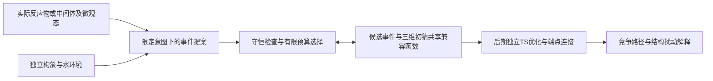

> 2026-09-22从mechai同步。源码规范以仓库为准：`/home/shen/文档/ChatGPT/mechai/docs/PROJECT_CONTEXT.md`。本页为可读镜像。

# mechai课题审阅：目标、科学问题与研究判断

审阅与目标校准日期：2026-09-22。依据仓库已有文献、实验和[用户科研目标记录](<2026-09-22 重要讨论｜科研目标、FlowER定位与主线调整.md>)。文档重整后已并行推进软件原型和有界CPU审计，实际结果见[STATUS](<2026-09-22 mechai当前进展.md>)；没有重新做全领域查新或新增量化计算。重整前正文保留在[背景快照](<../../../ChatGPT/mechai/docs/PROJECT_CONTEXT_ARCHIVE_20260922.md>)。

本文回答“为什么做、要证明什么”；[参考资料地图](<2026-09-22 课题参考资料地图.md>)回答“依据是什么”；[研发路线](<2026-09-22 课题研发路线与验收.md>)回答“按什么顺序验证”；[当前状态](<2026-09-22 mechai当前进展.md>)记录“实际完成了什么”。运行规则见[项目规范](<2026-09-21 mechai项目规范与接续入口.md>)。

## 1. 审阅结论

**主轴是“新模型 → 解决一类问题 → 有价值体系验证与新认识 → 高质量AI4S成果”。** 保留水相非酶促氨酰化作为候选验证体系，近期并行推进可证伪模型假设、最小事件—几何耦合组件及匹配数据合同。AI贡献尚未成立；原型软件可以推进，真实联合训练必须满足其自身数据与计算对照条件。

目前已证明的是：公开数据能够接入，官方模型能够运行，事件表示、规则枚举和分组评价能够实现。已完成的最小残差实验没有显示有用几何改善；源TS上的事件排序没有超过加强规则。这些负结果缩小了可研究范围，但没有否定所有环境条件生成方法。

当前主要缺口是**科学任务与学习标签之间的连接**：UniTS/Transition1x提供几何任务，USPTO/FlowER提供图变化任务，Kingfisher提供搜索条件化的微溶剂化诊断；尚无一套已审计数据同时提供独立反应物状态、明确微观态与溶剂环境、竞争事件以及对应三维验证。继续增加数据条数不能自动补上这些信息。

## 2. 重新明确的课题目标

暂定方法问题：**有限反应意图下，显式环境中的基元事件与过渡态几何联合提案**。氨酰化承担候选科学验证角色，模型任务不永久限于单一体系。这是研究方向，尚非已实现能力或新颖性声明。

| 层次 | 核心目标 | 成功所需证据 | 当前判断 |
|---|---|---|---|
| 科学目标 | 解释邻位氧保留/去除如何影响Ala-SEt与核苷的氨酰化，并预测其他结构扰动 | 比较酸碱、电子、构象、溶剂和水解解释；后期以一致协议的路径与竞争势垒及实验约束检验 | 问题有具体实验锚点；本项目尚无目标体系计算结论 |
| AI目标 | 在给定实际反应物/中间体、微观态及有限反应意图时，提出未预先指定的事件/参与溶剂模式及其三维候选 | 独立留出、相同总预算下优于强规则/频率及适配的已有方法；后期提高连接正确端点的通道发现效率 | 假设未证实；当前排序任务已接近规则上限 |
| 近期研发目标 | 检验共享兼容函数能否通过事件与几何的相互约束，改善同总预算下的已知事件—几何覆盖 | 强规则、单向条件、最终重排及双向消融；可靠同样本标签与独立留出 | 候选协议与软件原型并行推进；正式化学效果数据尚不充分 |

首周仍用于判断数据适用性、复现能力和最小架构假设，不要求首周发现新机理。起步不新增DFT/xTB，允许使用公开的既有量化标签；后期独立DFT是物理验证标准。服务器、DFT软件或实验合作者不再作为公开标签工作开工前需要重复确认的条件。

## 3. 科学问题：邻位氧为何重要

实验锚点为Singh等，*Thioester-mediated RNA aminoacylation and peptidyl-RNA synthesis in water*，Nature 644, 933–944 (2025)，[DOI](https://doi.org/10.1038/s41586-025-09388-y)。以下来自已有全文/SI核读笔记的Table 6（印刷p55），不是本项目实验。

| 核苷 | 保留的研究位点 | 该位点终点产率 | 总产率 | 对课题的约束 |
|---|---|---:|---:|---|
| 腺苷16A | 2′-OH与3′-OH | 3′酯15%；2′酯5% | 23% | 母体参照；总产率包含其他酯化形式 |
| 2′-O-Me 25A | 3′-OH | 3′酯22% | 23% | 邻位OH被封闭后仍保留明显反应 |
| 2′-deoxy 21A | 3′-OH | 3′酯1% | 1% | 删除邻位氧后显著减弱 |
| 3′-O-Me 24A | 2′-OH | 2′酯18% | 19% | 反向位点对照 |
| 3′-deoxy 22A | 2′-OH | 2′酯9% | 10% | O-Me/deoxy效应具有位点不对称性 |

名义条件为Ala-SEt约200 mM、核苷20 mM、pH 6.5、室温24 h。原资料中MES标注/浓度、H₂O/D₂O比例及22A总产率存在来源差异，不能视为已完全配方匹配的因果实验。完整定位和差异见[实验约束笔记](<../../../ChatGPT/mechai/docs/references/solvent-literature/2025_硫酯介导RNA氨酰化_实验约束与科学问题.md>)。

优先问题是：**为何保留邻位氧的O-Me与去氧对照表现不同，哪种解释能够同时解释两组位点对照，并预测未用于调参的结构扰动？** 不能把“邻位自由OH必需”或“水接力必然主导”作为前提。先保留完整核苷；单核苷结论不外推双链RNA位点可及性。

| 待比较解释 | 应检查的区分证据 | 主要混杂/限制 |
|---|---|---|
| 酸碱微观态占比 | 供体/受体质子化状态与占比代价；位点和条件趋势 | 少数微观态的低势垒不等于总体快；pH曲线可能混有缓冲剂变化 |
| 电子与局部氢键效应 | 保留/删除氧、供体修饰对亲核性和相对势垒的影响 | O-Me/deoxy同时改变构象和溶剂作用，单一对照不能唯一归因 |
| 构象与预组织 | 糖环、进攻取向和构象分布；跨构象的趋势稳定性 | 只比较一个最低能构象会隐藏占比与熵代价 |
| 溶剂参与与质子转移 | 允许直接及不同水参与模式，比较遗漏路径是否改变相对结论 | 找到水链不证明主导性；净H编辑不确定协同或分步 |
| 形成/降解竞争 | 氨酰化、供体水解与必要的产物稳定性分支 | 24 h产率不是初始速率；不能直接换算ΔΔG‡ |

“酸碱和电子解释已足够，复杂水接力不改变结论”也应是允许出现的科学结果。若如此，AI贡献仍需另有可验证增益，不能以一个漂亮TS替代方法评价。

## 4. AI任务与输入边界

近期研究范围是**有限意图下的事件—几何提案**。完全未知产物不是必需前提；净转化、反应中心或端点可以显式给定。完整映射H产物已揭示的净H去向不能再算未知事件发现。完整氨酰化可能由多个基元步骤组成，不强制整个净反应只经过一个TS。

拟议的最终输入包含：带原子身份/显式H/立体信息的当前图，已知形式电荷与自旋证据，指定微观态，独立于目标采样的构象/水环境，以及明确给出的反应意图。未知电荷或自旋保持未知；给出一个微观态不表示已学会其pH分布。

拟议输出为：守恒的候选事件、参与溶剂/质子去向，以及各事件对应的多个TS初猜。当前已有实现仍是“规则提供候选＋网络排序”，尚无已验证的可学习变长事件生成器。

此图表示待验证路线。[架构V0](<2026-09-21 架构定稿V0｜显式事件与环境条件几何.md>)保留历史接口；新的[模型假设V1](<2026-09-22 模型假设V1｜事件与几何共享兼容函数.md>)只引入一个共享标量兼容函数。真实事件条件UniTS训练/生成尚未执行，距离原型也不能区分镜像。

三类任务分开报告：

1. **图状态→下一步标签**：USPTO净编辑、FlowER模板步骤用于产品无关接口和图提案研究；训练/评价可使用标签产物，推理输入不读取目标产物或后续状态。
2. **指定事件/端点→TS几何**：UniTS和Transition1x用于几何条件与初猜诊断；已知产物、反应位点或参考TS派生条件须明示。
3. **真实水相状态→竞争路径判断**：还需要微观态、环境分布、未由目标筛选的候选与独立物理验证；前两类成绩不能直接充当第三类证据。

## 5. 数据分工与尚缺的连接

| 数据 | 当前可用内容与角色 | 不支持的结论 |
|---|---|---|
| UniTS-Lib | 4,391条；官方Formula-OOS基线和最小残差对照已运行 | 条件部分来自参考TS；没有因此获得独立反应物到机理能力 |
| Kingfisher CH2O | 50条/21组距离诊断；41条/19组限制域事件；11条/7组源端点敏感性 | 源TS和端点受搜索条件化；单一家族且样本反复用于探索 |
| Kingfisher CO2 | 44条标准water/21组的输入合同审计；11条自定义溶剂单列 | 未通过原初始加成单步合同，不是CH2O独立同任务测试或化学负例 |
| Transition1x公开预处理 | 10,073条R/TS/P；公开初猜几何诊断 | 缺显式图/电荷/多重度/产品无关事件标签；1,073补集未做家族独立性认证 |
| USPTO-15K | 反应物侧净变化核心基线与严格身份去重留出 | 净变化原子对不等于完整事件、电子流或水相机理 |
| FlowER双版本 | 1,622,935/2,174,470步骤；全量格式和numeric组RDKit抽样已完成 | 多数中间步骤由模板生成且分支按已报道产物筛选；无三维水环境或完整竞争通道监督 |
| RGD1当前下载包 | 176,992条聚合特征统计 | 缺独立SMILES/HDF5资产，尚无事件或几何训练入口 |
| DORTS-9K等其他来源 | 文献/元数据候选 | 未做本项目可用性验证，不写作已接入 |

**FlowER值得做一次有界入口核查，但不能成为无限延长的替代课题。** 它可检验图状态预测与守恒适配，不能独自验证“显式环境帮助发现竞争水相路径”。即使推理只读反应物，标签生成仍可能受已知产物筛选影响；这与直接把产物输入模型是不同的问题，两者都应记录。

本轮FlowER审计收尾后不自动训练或扩展全化学域。“FlowER图预测先赢过频率基线”只属于该辅助任务的继续条件，不再作为事件—几何研究的通用前置条件。配对字段与目前可运行任务见[数据合同](<2026-09-22 事件与几何配对数据合同.md>)。

## 6. 课题价值、风险与取舍

- **可保留的价值**：结构对照具体；自动搜索已有强基线；AI是否减少路径遗漏可以设计预算匹配的比较；负结果可用于区分不同物理解释。
- **尚未成立的创新**：生成TS、图与三维结合、含S/带电支持、自动选择参与水、使用守恒约束均已有先例。潜在贡献在于从独立状态输入学习未给定决策，并在未见条件下取得有用且可验证的增益。
- **首要风险**：用源TS恢复事件的捷径、模板标签的产物筛选偏差、跨数据集的任务错位、稀少独立组，以及把局部簇势垒误写为溶液选择性。
- **保留**：官方基线、事件记账/枚举、证据掩码、分组控制、几何接口、来源追踪与失败记录。
- **关闭或暂停**：41条源TS排序调参、8条几何诊断调参、扩大当前网络、未经同任务审核拼接CO2、直接串接FlowER与水相几何模型。

判断是否继续的关键是：先在明确的数据合同下证明有可学习而强规则尚未解决的问题，再用一个最小改变检验；若不存在，收缩AI命题或更换能提供所需标签的任务，并明确其与目标氨酰化问题的距离。[研发路线](<2026-09-22 课题研发路线与验收.md>)给出具体验收与停止条件。
