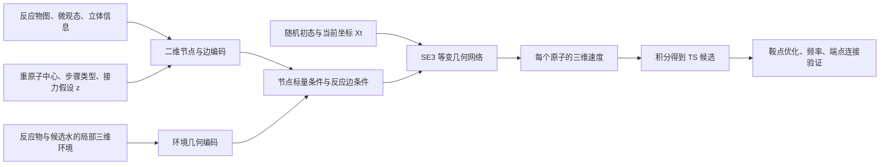

# 三维生成架构比较

**建议优先借 UniTS-Gen 的“全分子图＋已知反应中心”条件接口，借 MolGEN 的随机初态条件流来保留多种几何解；用 TS-DFM 的原子对表示补充接力边与距离信息。React-OT 更适合“参与水、接力和两端构象均已指定”的精修对照。** 这不是把四个模型串起来：本课题最关键的新增变量是参与水和质子接力，其余模块应围绕这些未知量组织。

本报告中的“多模态”需区分两件事：**输入模态融合**指二维图、三维环境与反应条件一起使用；**输出多峰分布**指同一条件可产生不同接力模式或不同 TS 构象。混合多种输入不自动产生多峰输出。

## 一、原文架构事实

### 1. 对照总表

| 问题 | React-OT | MolGEN | TS-DFM | UniTS-Gen |
|---|---|---|---|---|
| 被生成的变量 | TS 笛卡尔坐标 | TS 坐标，或另一个模型中的产物坐标 | TS 全原子对距离矩阵，再重建坐标 | TS 笛卡尔坐标 |
| 实际条件 | 原子类型、映射一致的 R/P 三维构象 | TS 模型：R/P 三维结构；产物模型：R 三维结构 | 原子类型、R/P 距离矩阵；重建仍用 R/P 三维几何 | 二维分子图、反应位点原子索引；图特征含电荷、自旋与立体信息 |
| 网络骨干 | object-aware LEFTNet，局部几何框架、标量化与张量化 | 球谐／径向表示与 CG 张量积消息，反应消息拼接，等变 Transformer | TSDVNet 双分支；原子与原子对特征；跨状态与状态内消息；三角更新 | 2D GCN 条件编码器＋HiEGNN；高阶 SO(3) 表示与 SO(2) 等变注意力 |
| 生成起点 | 对齐后 R/P 坐标中点 | 标准高斯随机坐标 | R/P 距离矩阵平均值 | 高斯随机坐标 |
| 主要监督 | 直线流的速度 MSE | 流匹配＋修改的条件 JS 目标；有不同训练组合 | 距离速度 MSE，训练插值加入小高斯噪声 | 坐标噪声预测 MSE |
| 固定条件下的多解 | 默认确定性单解；可外部变换端点构象 | 随机初态提供多解；每次 ODE 本身确定性 | 默认确定性单解；多通道需端点正常模扰动 | 初态与逆扩散采样提供多解 |
| 手性依托 | SE(3) 设计与三维条件，论文明确不要求反射对称 | 三维条件、等变架构；未见独立手性标签／损失的专门说明 | 距离无法区分镜像；借已知端点初始化坐标重建 | 图中 chiral tag、CIP、键立体信息＋SE(3) 几何网络 |
| 能否直接推断未知参与水 | 原架构没有该离散输出 | 原架构没有显式参与水／接力输出 | 原架构没有该离散输出 | 指定反应中心的接口最接近，但原评测不等于未知接力推断 |

四者都没有用生成时间参数直接表示真实化学反应时间。**从噪声或初猜到 TS 的生成轨迹，不是 R→P 的 IRC、MEP 或真实动力学轨迹。**

### 2. React-OT：有信息的确定性初猜，比网络名称更重要

令已对齐的反应物、产物为 $R,P$，参考 TS 为 $X^\ddagger$：

$$
X_0=(R+P)/2,\qquad X_t=(1-t)X_0+tX^\ddagger,
$$
$$
\mathcal L_{\rm OT}=\mathbb E\left\|v_\theta(X_t,t;R,P,Z)-(X^\ddagger-X_0)\right\|^2.
$$

推理时固定 R/P，从中点积分 ODE。网络不是预测能量、力或 Hessian，而是预测“朝训练目标移动”的生成速度。固定初态和条件下没有潜变量，因此不能通过反复运行同一输入得到不同水链。

LEFTNet 将局部节点／边的等变几何框架用于标量化与张量化；object-aware 改造允许反应物、产物中的独立片段处理各自的任意刚体坐标。基础实现有 6 个等变更新块、196 个隐藏通道和 96 个径向基，但研究贡献不能概括为这些超参数。论文从 OA-ReactDiff 检查点切换到 OT 目标微调，说明生成目标和源分布可以与网络骨干分开设计。

**手性细节需保留疑点。** Methods 明确写有意打破反射对称；同一节又提到训练几何对齐涉及 reflection，实际 R/P 对齐一节则写 SE(3) Kabsch。本文没有进一步核查代码以消除文字歧义。我们不应直接照搬允许镜像对齐的数据处理。

**原文位置**：[React-OT 正文](https://doi.org/10.1038/s42256-025-01010-0)，Fig. 1；Methods 的 “Equivariance in modelling chemical reactions”“Details about React-OT / Practical implementation of flow matching”“LEFTNet”“React-OT training”；SI §1 “Physical symmetries and constraints”。

### 3. MolGEN：ODE 确定性，不代表输出没有随机性

MolGEN 有两个独立任务模型。生成 TS 时分别计算 $R,P,X_t$ 的几何消息并拼接；生成产物时拼接 $R,X_t$ 的消息。**不是一个模型在一次采样中联合产生未知产物图和 TS。**

节点含元素嵌入。边用径向基、方向的球谐函数及 Clebsch–Gordan 张量积构造消息；反应状态的消息融合后，进入等变 Transformer，向量读出头预测每个原子的速度。SI S4 给出的消息最高阶为 $\ell_{\max}=2$。

其标准高斯初态 $\epsilon\sim\mathcal N(0,I)$ 经如下条件路径走向目标：

$$
X_t=tX_1+\bigl[1-(1-\sigma_{\min})t\bigr]\epsilon,
\quad
u_t=X_1-(1-\sigma_{\min})\epsilon.
$$

每次从不同 $\epsilon$ 出发，固定的 ODE 也能给出不同目标。这一点比“选 flow 还是 diffusion”更直接决定多样性。随机初态不保证所有化学通道都被覆盖，仍受标签的分布和条件信息制约。

**loss 不宜抄成一句标准 MSE。** 正文式(1)与 SI 表 S1 标为 L1 流匹配，Methods 式(16)另给二次回归形式；作者还使用修改的条件 JS 损失，并比较 L1→JS 微调、L1+JS→JS 等组合。其 JS 构造改变了高斯方差、去除了归一化因子，并固定采样位置；不能把它直接等同为精确计算完整生成分布的 JS，也不能解释为满足鞍点条件的物理约束。SI 对 Transformer 层数亦有正文文字“8 层”与表 S14“6 层”的差异，复现前应再核对代码。

论文的 object-aware SE(3) 结构及三维条件有助于几何建模，但本次原文未见专门的核苷手性保持机制或单独手性损失。因此不能凭模型名直接保证立体化学。

**原文位置**：[MolGEN 正文](https://doi.org/10.1038/s41467-026-75654-w)，Fig. 1，式(1–2)、(16–25)、(27–29)；Methods 的 “MPNN”“Reaction messages”“Object-aware message passing”“Readout by an equivariant transformer”；SI S2、S4。

### 4. TS-DFM：强项是原子对关系，代价是重建和手性信息缺失

TS-DFM 将主生成变量换为 $D\in\mathbb R^{N\times N}$，起点为 $D_0=(D_R+D_P)/2$。训练采样为：

$$
D_t=(1-t)D_0+tD^\ddagger+\sigma\epsilon,
\quad
\mathcal L=\mathbb E\|v_\theta(D_t,t;D_R,D_P,Z)-(D^\ddagger-D_0)\|^2.
$$

正文给 $\sigma=0.1$ 以改善鲁棒性；**这不等于其默认推理已成为随机多解生成**。推理从确定性 $D_0$ 开始；替代通道实验另行扰动端点。

TSDVNet 的双分支结构相同但参数不同：一支编码当前 TS 距离，一支编码 R/P 条件。每层同时维护节点和原子对表示，依次做跨状态消息、状态内消息、节点到原子对更新，以及沿三角关系的原子对更新。这里的 “Cross-Molecule” 主要指 R/P/TS 表示的融合，不能误读为专门的溶剂—溶质相互作用网络。

坐标重建解加权距离拟合，默认权重 $1/\hat d_{ij}^{2}$，用 L-BFGS。纯距离不知道左右手，作者依赖 R/P 坐标中点作为重建初值传递立体信息；没有一个额外的显式手性损失。距离表示加三角更新也不自动严格保证任意输出矩阵都可在三维中嵌入，更不能保证生成结构是鞍点。

**原文位置**：[TS-DFM 正文](https://doi.org/10.1038/s41467-026-74101-0)，Fig. 1；Methods 式(7–10)、(11–21)、(22)；“Reconstruct molecular structure from distance geometry”“Details of model training”；Results “Discovering alternative reaction pathways”。

### 5. UniTS-Gen：最值得借的是条件注入方法

输入没有要求产物三维结构。二维编码器接收分子图与反应位点子图，两者使用图卷积模块编码。节点特征含元素、显式度数、总电荷、自旋多重度、chiral tag、芳香性、价态、氢数、CIP；边特征含键类型、键方向、立体信息、环与共轭状态。

位点表示聚合后广播到节点，和节点级图表示、时间嵌入一起经 Bridge 投影，再加入几何网络 **$\ell=0$ 标量通道**，称为 TASFs。高阶部分继续处理方向信息。这是可解释、容易迁移的二维条件注入位置：标量化学条件不会因旋转而改变，几何向量和高阶张量按旋转规律变换。

HiEGNN 根据当前噪声坐标构造动态图，生成高阶 SO(3) 表示，再经包含 SO(2) 等变图注意力的 Transformer 块，最后输出三维噪声。它不是“普通 EGNN 换个名字”，也不是把二维和三维坐标直接串联后交给普通 Transformer。

只对坐标扩散，原子身份和图条件固定：

$$
X_t=\alpha_tX^\ddagger+\sigma_t\epsilon,\quad
\alpha_t^2=\mathrm{sigmoid}(-\gamma_t),\quad
\sigma_t^2=\mathrm{sigmoid}(\gamma_t),
$$
$$
\mathcal L_{\rm diff}=\mathbb E\|\epsilon-\epsilon_\theta(X_t,t;c)\|^2,
\quad \epsilon\sim\mathcal N_{\rm zero\ center}(0,I).
$$

反向采样是条件高斯逐步去噪。随机性允许同条件多种构象与立体反应路径，但输入已有手性应被保留，新生成反应中心的手性则可能需要多样采样。

**与本课题相关的条件差异**：SI Note 4 中，基准的图由真实 TS 坐标提取，位点根据真实 TS 虚频确定。因此其“固定反应中心”条件可能比我们预先知道的硫酯重原子中心更完整；不能把未指定质子链的全部难题隐含塞进真实位点标签。

**原文位置**：[UniTS-Gen 正文](https://doi.org/10.1038/s41467-026-77230-8)，Fig. 3；Methods “2D molecular graph encoding”“HiEGNN denoising kernel”“Topology-augmented scalar features”“Diffusion model”，式(3–12)；SI Note 4、Note 8、Fig. 5–6。

## 二、对本课题的架构建议——以下不是上述论文已完成结果

### 1. 先把未知量显式定义

设条件 $C$ 包含反应物图、重原子反应中心、微观态／电荷／自旋、已知立体化学、反应物与候选水的局部三维环境。用 $z$ 表示参与水的离散选择及质子接力图，用 $X^\ddagger$ 表示整套原子的 TS 几何：

$$
p(z,X^\ddagger\mid C)=p_\psi(z\mid C)\,p_\theta(X^\ddagger\mid z,C).
$$

这是可审计的分解：第一部分回答“谁参与、质子沿哪些边传递”，第二部分回答“这种假设如何在三维空间实现”。两个模块可以共享编码器并联合训练，但共享参数不等于已证明几何和机制一致。

**三维模块不应再要求一个完整优化好的产物构象。** 否则为了准备模型条件，可能已经需要先解决最想研究的水链与质子归属。

候选原子池在一次任务中固定，包括全部显式氢与一组候选水。$z$ 标记“参与”，不直接把未选水从输出体系删除：非参与水仍可能稳定 TS，删除它们会同时改变所研究的势能面。不同水数的体系用大小可变的图和 mask 表示，而不是让模型创造／消灭原子。训练需显式包含无接力水或不同参与数的模式，否则选择头只是从已有模板中分类。

还要保留**基元步骤类型**：亲核加成、四面体中间体后的离去、质子转移可能分步，也可能协同。固定酰基转移中心并不意味着总反应必有一条单 TS 路径。

### 2. 一个建议优先实现的 3D 条件模块

**条件编码**借 UniTS-Gen，但做两项针对性改动：

- 位点信息同时保留节点标记和**成断键／接力边的原子对嵌入**，不只把整个中心平均池化。接力的方向、哪个氢从哪到哪，不应在全局平均中丢掉。
- 几何环境分支与当前生成几何分支在原子对应关系和原子对特征上融合，借鉴 TS-DFM 的双分支思路，但不强制把全部生成改为距离矩阵。节点条件可注入 $\ell=0$，边条件进入几何消息或注意力。

**生成变量采用三维坐标**，建议用可表达方向耦合的 SE(3) 等变网络输出向量速度；高阶张量／注意力可作为骨干候选。先保留简单可解释的条件流目标，不急于加入 MolGEN 的修改 JS。是否需要高阶到多少，属于后续消融问题，不能由 UniTS 的结果直接推出本体系唯一最优阶数。

**源分布采用围绕可获得反应物环境的随机初猜**，而不是 R/P 确定性中点：

$$
X_0=X_R+S(C)\epsilon,\quad
X_t=(1-t)X_0+tX^\ddagger,\quad
u^*=X^\ddagger-X_0.
$$

$S(C)$ 是按节点角色确定的噪声尺度，每个原子的三个方向等尺度，以保持旋转一致性；中心、可转移氢与水可采用更宽扰动，稳定骨架较小扰动。这里明确提出的是新设计，不是 React-OT 或 MolGEN 的原始配方。它需要检查是否因过强反应物先验漏掉较大构象重排；因此保留“纯高斯初态”和“分组随机初态”的消融。

同一 $z$ 采样多个噪声初态，表达几何多峰；不同 $z$ 表达接力拓扑多峰。模型采样比例由数据和训练决定，**不能当作真实 Boltzmann 权重、路径通量或产物比例**。

### 3. 对称性与手性：直接关系到化学是否学对

1. **整个溶质—水环境共同旋转／平移应等变。** 但给定的局部水位置是有物理意义的条件，不能把每个水的独立转动／移动都当作不改变问题的对称操作。React-OT／MolGEN 的独立片段对称设计，适用于任意放置的独立端点分子；不能原样施加到一个已定义的氢键环境上。
2. **相同水分子的编号应可置换。** 编码器与选择头应对候选水排列等变；评估参与水或接力时应按化学角色和允许的置换匹配，避免奖励记住索引。同理，氢原子的标签映射需一致，不能靠任意重编号制造错误的“新接力”。
3. **已知生物分子手性不能被镜像配准消掉。** 训练对齐只用 proper rotation，即 $\det R=+1$；保留 CIP／局部手性条件。可加保留手性中心的有向体积符号约束，但不约束本来可能平面化、反转或新形成的反应中心。
4. **不要强冻全部非反应中心坐标。** 核苷构象与氢键网络可能协同调整。生成时可软限制稳定骨架位移；最终量化验证应按明示边界条件弛豫，而不能把冻结环境下成功冒充自由体系成功。

### 4. 损失函数和验证各做什么

基础几何损失为条件速度 MSE，可对反应中心、转移氢、溶剂分别归一化，以避免大核苷的远端原子稀释关键梯度。附加项只承担明确定义的作用：

$$
\mathcal L=\mathcal L_{\rm flow}
+\lambda_{\rm pair}\mathcal L_{\rm pair}
+\lambda_{\rm stereo}\mathcal L_{\rm stereo}
+\lambda_{\rm clash}\mathcal L_{\rm clash}.
$$

- $\mathcal L_{\rm pair}$：在接近终点的预测干净结构上，监督成断键、质子接力与氢键相关原子对几何；距离表示可借 TS-DFM，但要避免一个硬阈值排除合法的共享质子 TS。
- $\mathcal L_{\rm stereo}$：仅保持不会参与立体改变的已知手性中心。
- $\mathcal L_{\rm clash}$：惩罚严重原子重叠，不能用普通稳定分子价键距离强行约束所有 TS 键。

这些附加项不是默认都要加入的清单，首先以纯条件 flow 为基线，逐项验证作用。也不应在所有噪声中间态强加“必须化学有效”，因为线性生成插值本来就不是物理反应路径。

没有一个损失可以替代后验验证。$\nabla E=0$ 只能说明驻点，不区分极小值与鞍点；一个负特征值也不保证连接目标反应。最终分别报告离散模式召回、几何多样性、鞍点优化、单虚频和 IRC 端点正确率。

### 5. 最有判别力的四个架构对照

| 对照 | 回答的问题 |
|---|---|
| 人工／参考接力条件 vs 预测接力条件 | 主要误差在离散选择还是几何实现？两种结果必须分开 |
| 相同条件下确定性初态 vs 随机初态 | 多个候选是否找回真实不同 TS，而非只增加重复构象？ |
| 仅中心全局池化 vs 节点＋接力边条件 | 接力连接关系是否需要显式进入局部消息？ |
| 仅图条件 vs 加三维溶剂环境 | 模型是否真正利用水的几何与微观态，还是复述训练集中最常见水链？ |

比较中应固定独立采样数和后验验证预算。若只比较最接近参考 TS 的样本，无法证明实际使用时会选中正确低能通道。

## 三、读论文时应保留的判断

**最贴近当前任务的接口是 UniTS-Gen，最值得借的多样性机制是 MolGEN，最适合表达接力局部关系的是 TS-DFM 的原子对特征，React-OT 提供有条件几何精修的清楚基线。** 建议中的创新不在任选一种 flow 或高阶网络，而在未指定参与水与接力时，能否学到可迁移的离散选择—三维实现关系，并通过正确的基元步骤与端点验证。

RitS 未取得全文，故本架构比较不推测其编码器、loss、手性实现或训练细节。

综合选型与第一版边界见[[2026-09-21 架构设计讨论｜前生物氨酰化的条件生成]]。本篇包含备选设计，不表示全部模块都应在第一版实现。
