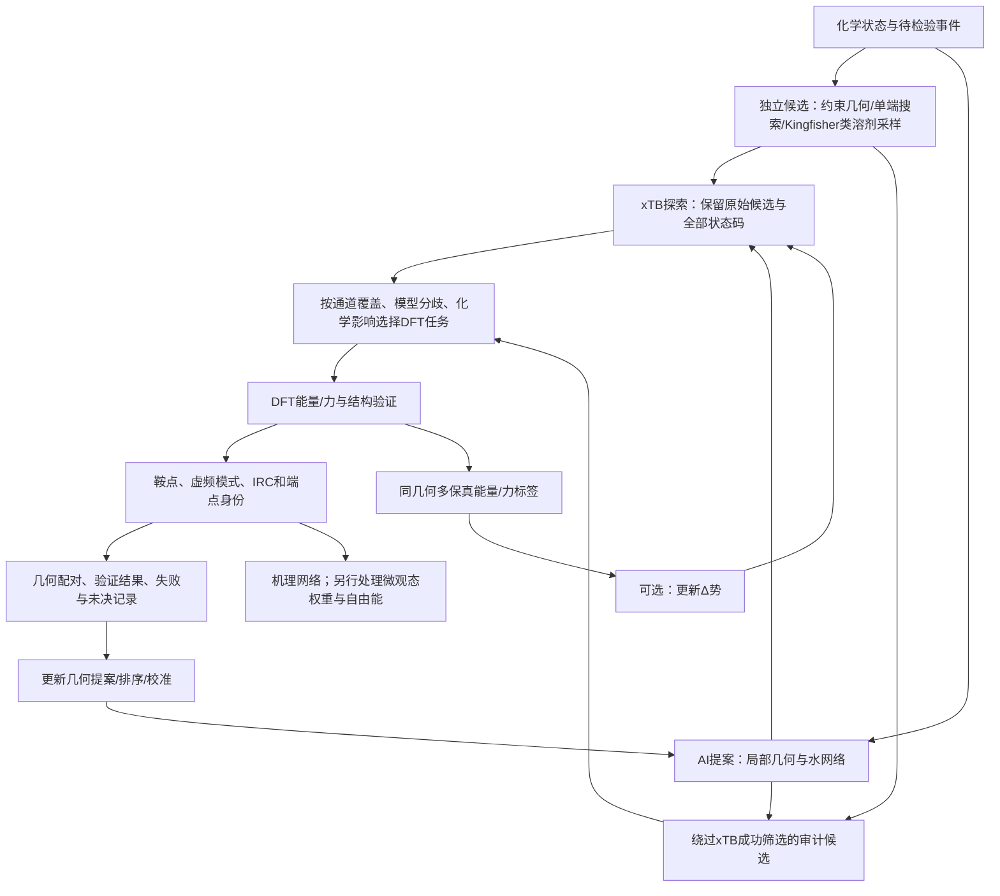

# 多保真学习与验证接口

**建议把 AI 的主体放在“给定化学事件后，提出多样的局部反应几何与溶剂组织”，把 xTB 作为可犯错的低层次探索器，把 DFT 验证作为独立接口。Δ 势、几何生成、候选排序和不确定度承担不同任务，不能共用一个含糊的“DFT 分数”作为标签。** 冷启动先诊断 xTB 的偏差类型；有足够正确配对结构后再学习几何，有局部能量/力覆盖后才考虑 Δ 势。不必同时训练四种模型。

本设计服务于一个具体科学任务：自由 α-氨基硫酯对核苷羟基的酰基转移，如何与水解、不同核糖位点及质子接力组织竞争。最终科学解释需要同时尊重底物对照、微观态和溶液动力学，不能把找到的最低团簇势垒直接解释为实验终点产率。

## 1. 文献支持什么，不能据此承诺什么

| 依据 | 可直接借鉴的设计 | 不能外推的结论 |
|---|---|---|
| [DeePEST-OS，Nature Communications 2026](https://doi.org/10.1038/s41467-026-72945-0) | 在相同构型上学习 GFN2-xTB 到 DFT 的能量/力差，再供 TS 优化器使用；DORTS 的反应区域采样 | 它不是坐标生成器；其筛掉 xTB-IRC 失败路径的策略不能直接照搬为本课题的唯一数据入口；DORTS 含 S 不等于覆盖硫酯—核苷—水接力 |
| [Zhang 等，Nature Communications 2024](https://doi.org/10.1038/s41467-024-50418-6) | 把溶质、反应区＋少量水、较大溶剂环境、纯水构型联合用于局部势；使用描述符覆盖度选择补标点 | 600 个针对已知 Diels–Alder TS 区域设计的构型，不是本体系所需数据量的保证；SOAP 陌生程度不是已校准物理误差；该案例中溶剂效应不等于复杂水参与成断键 |
| [Célerse 等，JCTC 2024](https://doi.org/10.1021/acs.jctc.4c01201) | 多溶剂参与质子转移需要构型集合和自由能采样；低层次到高层次的势迁移可以改变定性机制判断 | 精确拟合低层次势也会继承错误：该文 PBE 与 PBE0 对两种溶剂相对反应性给出不同结论；大量采样不能自动消除电子结构偏差 |
| [Kingfisher，JCTC 2025](https://doi.org/10.1021/acs.jctc.5c00245) | 多次溶剂排布、单端搜索、TS 猜测的部分 Hessian、逐步缩小环境、TS 与 IRC 验证；作为非神经提案基线 | 振动幅度大的水是反应参与线索，不是全部关键水；低位移的静电稳定化水仍可能重要；不同水数的最低团簇势垒不能未经统计处理变成总体速率 |

Kingfisher 第一次溶剂筛选已发生在 TS 猜测产生之后、完整 TS 优化之前，所以“提前选出活性水”本身不是充分的方法创新。可以研究的增量是：**在保持底物手性和质子收支的条件下，对未知水组织提出更完整的竞争通道，并对未见底物/微观态提高正确连接率。**

数据审计还表明：Transition1x 无 S；RGD1 主动排除了离子/自由基，且 DFT 端点验证包含分类器替代；SPICE 有含 S 带电水合构型但原始版不以成断键为目标；OMol25 有反应构型但不是逐条 DFT-IRC 标签库。RitS 已报告含 S/带电生成，目标复合物的联合覆盖仍待核实。因此公开数据适合作先验，不能充当本体系的验证集。

## 2. 闭环结构：两类入口，一套验证出口

必须保留 `raw_seed`：xTB 优化前的原子坐标和原子映射。如果 xTB 把一个水接力结构压回反应物，或移到错误质子化盆地，DFT 审计必须能够从原始候选重新出发。只存 xTB 收敛结构会永久丢失审计信息。

“绕过 xTB”不是取消低层次探索，而是让一部分预先规定的、覆盖不同事件类别的候选直接进入 DFT 搜索/路径检查。这部分选择不能完全由同一个 AI 的置信度决定，否则所有模型共同忽略的机理仍没有进入验证的机会。

## 3. 每个学习任务的输入、输出和监督标签

### 3.1 Δ 势：学习同一构型上的势能与力修正

定义几何与状态为 $s=(R,Z,q,m,\mathcal E)$：坐标、元素、总电荷、多重度、环境定义。模型学习

$$
E_\theta(s)=E_{\rm xTB}(s)+\Delta E_\theta(s),\qquad
F_\theta(s)=F_{\rm xTB}(s)-\nabla_R\Delta E_\theta(s).
$$

标签为同一 $s$ 下的

$$
\Delta E^{\rm ref}=E_{\rm DFT}-E_{\rm xTB},\qquad
\Delta F^{\rm ref}=F_{\rm DFT}-F_{\rm xTB}.
$$

可用经过尺度归一化的能量与力联合损失。**力由标量能量求导得到**，避免一个独立力头产生与能量不一致的搜索方向。只有在明确接受非保守力并另行验证时才考虑其他实现，本任务初期没有必要。

标签接口要求：

- 两种方法必须在完全相同的坐标、原子数、原子顺序、总电荷、自旋和边界条件上评价。不能相减“xTB 优化构型的能量”和“DFT 优化构型的能量”，却把所得数当成某一几何上的 ΔE 标签。
- 溶剂模型若不同，Δ 包含“电子结构差＋环境模型差”；这可以定义，但必须写明。不能一端真空、一端带水或不同原子数，也不能把不可对应的力分量混合。
- 可减去一致定义的组成参考能，不能给每个构型随意归零。带电体系不同组成的绝对能量/形成能，需要保留可追溯参考。
- 数据要包括反应物附近、鞍点附近、路径两侧、质子转移畸变和竞争通道。仅在 xTB 的一个鞍点附近学习，会把其漏掉的盆地和拓扑继续遗漏。
- 总电荷应显式输入，但净电荷不能描述全部局部电荷迁移。需要检查较长程的电荷分离和氢键环境；局部截断势的拟合误差可能集中于此。

检验重点不是全体原子平均力 MAE：要单列反应中心力、质子方向力、路径垂直力、相关曲率/虚频模式及最终正确端点率。溶剂大量近似正确的小力可能掩盖少数决定机理的错误。

**适合启用的情形：** xTB 与 DFT 通道大体一致，但关键距离、局部曲率或相对势垒存在可学习的系统偏差。若 xTB 在某一微观态直接更换反应拓扑，Δ 势并非原则上无法修复，但需要跨越这些区域的目标能量/力标签；仅靠给现有最低能候选补几个单点不够。

### 3.2 几何 residual：修正已有候选的局部几何

输入为条件 $c$ 与候选 $R_0$，输出局部位移、反应中心相对几何，或内部坐标修正。条件至少包括反应物/产品连接的候选假设、待改变键、微观态、原子映射、允许移动区域、水分子身份及底物手性。

监督对为 $(c,R_0,R^\ddagger_{\rm DFT})$。**配对要求同一有效反应事件和同一端点类别。** 若 xTB 候选经 DFT 进入另一反应，不应把它硬配成“巨大残差”；它应进入通道改变/错误端点记录。若一个初猜通向多个 DFT TS，应保留多模态标签，不能取坐标均值形成并不存在的“平均 TS”。

几何损失可用对齐后的局部坐标误差、键长/角度误差，以及手性和原子碰撞约束。水的置换对称性要在对齐/匹配时处理；参与质子交换的氢必须有稳定映射，不能用任意最近氢重新编号来消除真实误差。保持适当旋转/平移等变性，并保留手性条件；不能把镜像产物当作等价样本。

residual 不自动满足驻点、负曲率或正确 IRC 条件。其角色是提供更好的初猜，而不是输出“已经验证的 TS”。单个 DFT 单点的能量/力可作为辅助数据，不能替代经结构验证的坐标终点标签。

### 3.3 条件 flow：在固定组成内生成多个有效组织

flow 可以在条件 $c$ 下把一个简单或化学约束的初始分布变换为目标 TS 候选分布。若以参考桥接轨迹 $R_t$ 定义流匹配，训练目标是预测对应速度场；它需要的核心监督是**多样且有效的目标结构分布**，而不是一串标量能量。

生成范围初期建议限制为反应中心、供受体相对位姿及显式水网络；核苷骨架可来自独立构象集，按掩码保持或有限调整。这样把“本就合理的底物构象”与“困难的反应组织”分开。

三个接口边界：

1. 水数/原子数的选择是离散上游变量，固定维度的 flow 不能在连续坐标变换中凭空增删水或质子。先选择状态和组成，再生成该组成内的候选。
2. 有些拓扑只在 DFT 上存在，不能要求生成起点必须是成功 xTB TS。独立几何候选和 DFT 发现的通道也要进入目标分布。
3. 生成样本频率反映训练与采样策略，不是自然界通道布居、承诺概率或反应通量。即使某一拓扑被生成很多次，也不能据此判为主机理。

**small-data 决策：** 先比较“无学习候选”“局部 residual”“条件 flow 微调”在留出反应组的正确连接率与通道覆盖。只有多目标结构确实存在并有足够独立监督时，flow 相对 residual 的价值才可以被检验；不能以路径帧很多来代替独立反应很多。

### 3.4 候选排序：预测明确验证协议的结果

最直接标签不是“反应好不好”，而是候选经过固定 DFT 后处理流程后的结果：

- `verified_intended_saddle`：满足鞍点及目标端点条件；
- `verified_other_channel`：是鞍点但连接另一通道；
- `minimum_or_wrong_curvature`：极小值或不符合所需负曲率；
- `optimizer_failed`、`electronic_failed`、`unresolved_endpoint`：过程失败或证据未决。

后面三类不能都当作“化学反应不存在”。可以训练“在协议 P 下成功找到目标鞍点的概率”，但不要把该概率称为真实存在概率。程序版本、初始 Hessian、终止规则变化后，标签分布亦会改变，需要重新评价。

对于同一组成、同一微观态、同一参照和同一量化层次，另可训练已验证候选的势垒排序。它必须与成功率分开：**初猜易优化不等于对应通道低势垒**。跨组成、不同水数或不同质子数，不能直接训练混合能量排名而省略热力学参考。

选择候选时至少同时保留新通道与不同水拓扑。把所有名额给最高成功概率，可能反复找到一个容易的已知通道，降低真正需要的竞争机理召回。

### 3.5 不确定度：指导补证据，而非提供化学结论

需要分清四件事：

| 信号 | 能指出什么 | 指不出的情况 |
|---|---|---|
| 势模型集成对能量/力的分歧 | 在现有训练分布与模型族下的不稳定区域 | 所有模型共享的偏差；参考 DFT 本身的系统误差 |
| 描述符/嵌入的距离 | 局部环境相对训练集陌生 | 全局质子接力不同但局部相似；未被生成的通道 |
| 候选成功概率的校准区间 | 类似候选在固定流程中的验证成功率 | 大幅分布外微观态；化学存在性；未尝试通道的覆盖 |
| 模型与独立搜索结果的分歧 | 潜在机理遗漏、提案偏差或水筛选偏差 | 尚未由任何路线提出的机制 |

校准应在按反应/底物/水拓扑分组的独立集合上做，不是在训练路径的相邻帧上做。即使使用 conformal 等方法，其覆盖保证也依赖对应的交换性/分布条件，不能宣称面对全新电荷或机理仍自动可靠。

DFT 选择策略采用覆盖约束，而非单一加权总分：保留固定的独立审计部分；其余在新通道、模型分歧、关键化学对照和已知通道精修之间分配。权重与阈值应由先导表现决定，当前不虚构“最优系数”。

## 4. 最小可审计接口

### 4.1 状态记录：`ChemicalState`

每条记录至少包含 `state_id`、底物结构/立体化学、全原子映射、净电荷/多重度、质子化与互变异构说明、显式水/其他组分、环境边界定义、待检验成断键和转移质子、反应物参照定义。pH 存为实验环境元数据，不作为模型自动改变质子数的开关。

上游可以枚举微观态，但枚举“可能状态”与断言“该状态有多大布居”必须分开。加减 H 改变组成时生成新的状态记录，不能覆盖旧记录。

### 4.2 候选记录：`Candidate`

保存 `candidate_id`、`state_id`、原始坐标、来源与随机种子、生成模型版本/条件、溶剂网络候选拓扑、父候选和全部变换。每次 xTB/AI/DFT 几何更新都产生新记录并保留父节点，不覆盖历史。

候选层允许“不知道产物的单端事件假设”，但不能把它标为已经验证的 R/P 反应。模型要求双端条件时，上游必须明确提供候选产品图；不同产品假设单独记录。

### 4.3 势能评价：`Evaluation`

保存方法完整定义、坐标哈希、能量、梯度/力、单位、计算状态以及有效性检查。成对 Δ 标签只有在坐标和状态键完全一致时建立。保留未收敛计算状态，但不将其数值当作训练目标。

### 4.4 结构验证：`Validation`

验证链分级保存：优化状态 → 曲率/虚频模式 → 双向 IRC → 端点优化 → 端点图与微观态身份。不能把“一根虚频”直接映射为通过，尤其存在水簇重排而溶质未反应时。

自由团簇的物理鞍点与部分 Hessian/QM/MM 区域鞍点应分别标记；Kingfisher 式区域逐步收缩期间的结果不混作完全相同的验证等级。IRC 端点中的水置换可按分子对称性归类，但转移质子的去向、产物位点以及接力发生后的微观态必须保留。

对形成真正新通道的“错误端点”不直接丢弃：先作为已验证替代通道记录，再由化学网络归类。确认不是目标产物也可能增加机理覆盖。

### 4.5 标签与切分：`TrainingManifest`

每个训练样本显式指定任务：`delta_EF`、`geometry_pair`、`conditional_TS_sample`、`protocol_outcome`、`within_state_barrier`。写明标签来源与验证等级；不得以“有 DFT”概括不同数据。

按母反应/底物、事件、微观态及水组织分组。同一轨迹的全部帧、一个 TS 的正反方向扰动、等价水排列和同一母分子的多个生成版本，不能随机拆到训练与测试。用于选择新标签的盲测组在解盲后不再被称为独立测试集。

## 5. 小型先导：先诊断结构偏差，再选学习模块

以下是建议设计，不是已完成实验，也不是对所需标签数的保证。先导不以训练一个可发表生成器为目标，而是回答“错误发生在哪里，什么监督能修复”。 下列18个分层用于定义候选空间，不要求一周内完成其全部笛卡尔积；可先从其中能诊断不同失败模式的少数分层取样，完整范围依据先导证据扩展。

### 5.1 化学面板

优先使用腺苷、2′-O-methyladenosine、2′-deoxyadenosine三个受体，供体固定为 Ala-SEt；检验保留相邻氧、移除相邻 OH 质子、移除相邻氧的差别。供体至少分别考虑游离 α-NH₂ 与 α-NH₃⁺ 状态；这是分开计算的微观态，不预先把其权重写进能量排序。

对每个组合建立三类起始假设：直接转移、单水接力、双水接力。可形成 **3×2×3＝18 个候选分层**，每层至少保留不同取向/氢键组织。分层数量不是有效独立反应数，失败层亦保留。三类仅是先导范围，不能据此宣称穷尽水数或机理。

并行设置竞争水解与另一核糖位点的针对性检查。水解参照和亲核体不同，单独建立状态及参照，不与不同组成的酰化绝对能量直接混排。3′-O-methyl/3′-deoxy 可留作之后的结构反向对照，避免所有对照都用于设计与调参。

实验数据只用于规定需要解释的对比，不直接当 TS 标签。SI Table 6 的终点产率不是初速，而且 MES 标记和溶剂比例存在记录差异；在条件未完全澄清前，不拟合其数值比为精确速率比。

### 5.2 配对路线：从相同原始候选出发

| 支路 | 作用 |
|---|---|
| X：原始候选 → xTB 搜索/鞍点/IRC → DFT 精修与验证 | 模拟常见的低层次筛选流水线 |
| B：相同原始候选 → 化学约束或单端路径辅助的 DFT 搜索与验证 | 绕过 xTB 几何收缩和成功筛选，检测低层次结构偏差 |
| K：独立溶剂组织/Kingfisher 类路线 → 对应 DFT 验证 | 检测手工/AI 提案本身未覆盖的溶剂通道 |

不能只把“已经通过 X 的候选”交给 B。B 的候选应按预先定义的分层抽取，包含 xTB 失败、高 xTB 势垒、错误端点和看似正常的案例。B 本身未找到鞍点时记录“未决”；不以单次 DFT 失败证明该通道不存在。

如果某条 DFT 验证通道只在 B/K 中出现，可判定当前 X 流水线漏掉了该通道。随后比较原始、xTB 及 DFT 几何与局部力，定位是质子误置、水网络塌缩、酰基进攻取向偏差，还是鞍点盆地不同。

### 5.3 诊断必须看结构与通道，不能只看能量相关图

至少输出以下四类观察：

1. **通道捕获表。** 对独立 DFT 已确认的通道，X 是否找到相同连接；反向记录 xTB 鞍点到 DFT 后失去驻点或改变端点。对于两层次都未解决的候选保持“未决”。
2. **结构偏差。** 成键 C–O、断键 C–S、转移质子的供受体距离与位置、羰基进攻方向、关键氢键、接力拓扑和底物手性；整体 RMSD 只作补充。
3. **同几何势差。** 在共同构型上比较 ΔE/ΔF；分别统计质子方向、反应中心与环境原子的误差。比较在 xTB 结构和 DFT 结构上评估的修正，辨别能量误差与盆地迁移。
4. **环境删减敏感性。** 对代表性候选，比较仅保留振动显著参与水、再加主要稳定化水两种定义；检查端点和相对结论是否变化，防止“水未明显动，所以可删”的错误。

此先导尤其能识别两种不同的假阴性：

- **排序假阴性：** 通道已被 xTB 找到，但估计过高而未被挑选；成对能量/力修正或重新排序可能帮助。
- **结构/覆盖假阴性：** xTB 根本不保留该鞍点/水网络，或提案从未产生该通道；任何仅作用于现有候选能量的排序头都无法找回它。需要独立结构入口、几何生成的目标支持或更高层次路径搜索。

### 5.4 先导结果如何决定架构

| 先导观察 | 优先模块 | 仍需保留的验证 |
|---|---|---|
| 大部分通道同构，DFT 只局部改变距离/方向 | residual 或条件 flow 的局部微调；多模态明显时才优先 flow | 盲测正确 IRC 与竞争通道覆盖 |
| 几何大致一致，但能量/力系统误差影响搜索或排名 | 局部 Δ 势 | 反应区力/曲率、端点与相对排序 |
| 很多失败来自碰撞、取向或不合格初猜，且易被输入特征识别 | 候选排序和几何质量过滤 | 保留独立探索份额，防止只偏爱易通道 |
| xTB 常将目标通道塌缩/换盆地 | 增加独立高层次候选来源；生成模型目标需覆盖这些通道 | xTB 失败分层的持续 DFT 审计 |
| 结论随水数、环境截断或构象持续漂移 | 先扩充环境/统计处理，静态候选架构不能单独给出选择性 | 自由能与采样收敛检查 |
| 小模型差异小于电子结构层次差异 | 先校验影响科学结论的参考层次 | 关键对照的独立参考比较 |

停止或降级一个学习模块不是课题失败。例如 Δ 势没有改善通道捕获，而几何提案稳定补回重要水网络，便应把贡献集中于结构生成与覆盖，避免为多模块组合增加无法解释的复杂性。

## 6. pH、自由能与实验产率的接口边界

### pH 必须通过微观态与反应网络进入

固定核数和净电荷的单个势能面没有“pH旋钮”。pH 影响的是不同质子化微观态的化学势、布居、质子交换，以及酸碱催化通道。条件生成器可以以某个微观态或显式酸碱参与者为条件，但不能单靠输入一个 pH 数字学出物理正确的质子收支。

仅当微观态互变相对反应足够快且参照一致时，可用类似

$$
k_{\rm obs}=\sum_\alpha p_\alpha(\mathrm{pH},\text{条件})\,k_\alpha
$$

的预平衡表达。多反应物的有效浓度、缓冲催化、离子强度及质子交换步骤还需显式处理；若不满足快平衡，应建立相应动力学网络。微观态概率来自经验证的 pKa/自由能/实验约束，不是 TS 排序概率。

### 自由能由统计权重和参照定义得到

DFT 单点/优化能量是势能信息。活化自由能还涉及反应物构象与环境集合、溶剂组织、熵、标准态与必要的动力学修正。不同水数团簇的能量相减需要把水的化学势和组装参照纳入；分别找到最低值后直接比较，不是可靠溶液通道竞争。

若未来学习自由能代理，训练标签必须来自明确集体变量和充分采样的自由能估计，并携带采样不确定度及参考条件。这个任务与本阶段候选评分不同，不能通过把能量头改名为“ΔG头”实现。

### 终点产率属于另一层级

核苷酰化的 24 h 产率同时受供体水解、多个位点成酯、酯水解、可能的酰基迁移、逆反应与浓度变化影响。正确 DFT 通道是必要的局部机制证据，不能直接回归成实验产率。若要预测终点，需把经验证速率/平衡信息放入质量守恒的反应网络，并对实验条件差异作出明确处理。

## 7. 建议的初版范围

初版保留五个清楚的部件：**化学状态与事件定义、独立候选生成、局部 AI 几何提案、带审计支路的 xTB/DFT 验证、带标签分级的数据库**。候选排序可从简单规则起步；Δ 势是否启用由先导中观察到的力/几何误差结构决定；不确定度负责挑选需要补证据的位置。

最有价值的第一项方法结果应是：在留出的底物/微观态/水组织上，局部生成是否在相同候选数下补回了非学习基线遗漏、且经独立 DFT 验证的竞争通道，并改变或强化了对关键底物对照的解释。它比单独降低 TS RMSD 更接近本课题的科学目标，也比承诺直接预测 pH 下产率更可检验。

## 参考来源

1. Ren, K. et al. *Reactive Machine Learning Potential for Accelerating Transition State Search in Organic Synthesis*. Nature Communications (2026). [DOI](https://doi.org/10.1038/s41467-026-72945-0)。本地全文与 SI 已读；DORTS 标签与验证审计见 `work/origins/data_scientific_fit_audit.md`。
2. Zhang, H.; Juraskova, V.; Duarte, F. *Modelling chemical processes in explicit solvents with machine learning potentials*. Nature Communications **15**, 6114 (2024). [DOI](https://doi.org/10.1038/s41467-024-50418-6)。本地正式全文：`work/origins/novelty_sources/explicit_ml_2024.txt`。
3. Célerse, F. et al. *Capturing Dichotomic Solvent Behavior in Solute–Solvent Reactions with Neural Network Potentials*. JCTC **20**, 10350–10361 (2024). [DOI](https://doi.org/10.1021/acs.jctc.4c01201)。本地正式全文：`work/origins/novelty_sources/dichotomic_2024.txt`。
4. Türtscher, P. L.; Reiher, M. *Automated Microsolvation for Minimum Energy Path Construction in Solution*. JCTC **21**, 5571–5587 (2025). [DOI](https://doi.org/10.1021/acs.jctc.5c00245)；[开放全文](https://pmc.ncbi.nlm.nih.gov/articles/PMC12160001/)。本地正式全文：`work/origins/microsolvation_2025.txt`。
5. Darouich, S. et al. *Robust generative transition-state models for unseen chemistry*. Nature Computational Science (2026). [DOI](https://doi.org/10.1038/s43588-026-01034-5)。目标域预训练/微调证明适应可能，但不提供本体系少量 DFT 足够的保证。

综合选型与第一版边界见[[2026-09-21 架构设计讨论｜前生物氨酰化的条件生成]]。本篇包含备选设计，不表示全部模块都应在第一版实现。
